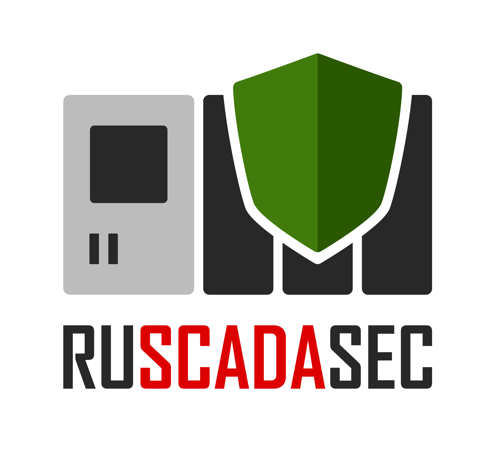
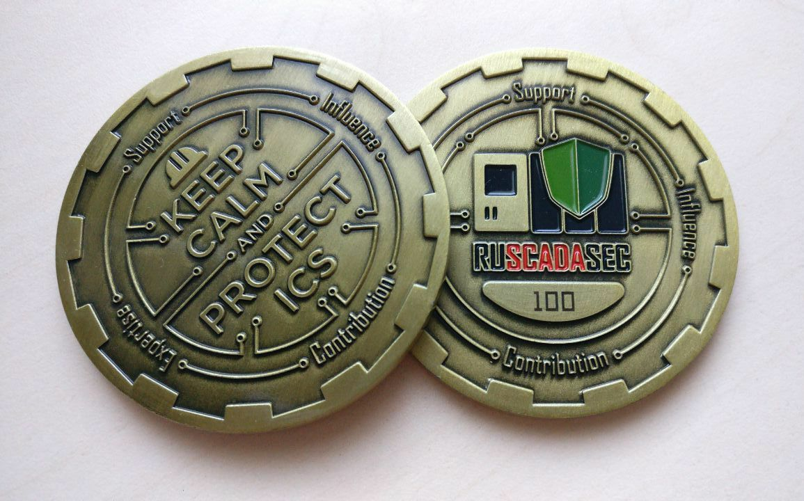

[Russian](http://ruscadasec.ru) | English

## About us

[](https://t.me/RUSCADASEC)

RUSCADASEC is an independent non-profit initiative on developing the open international community of industrial/operational technology cybersecurity professionals.

The initiative objectives are to raise the awareness and expertise of security and industrial automation specialists, to facilitate professional networking between specialists and organizations, to promote a security market, to develop relationship with like-minded foreign communities and increase general level of cybersecurity in industrial companies as a main goal.

The initiative encompasses online groups, live meetups and profile conferences, where the community members monitor main local and global industrial cyber security events, discuss organizational and technical aspects of the topic, share experience and ideas. We are always glad to have new members, ideas, and help on the community developing. Join us!

[](https://t.me/RUSCADASEC)


<!---

 ## We are here, join us!

* [[ Telegram group ]](https://t.me/RUSCADASEC) 2K+ members
* [[ Facebook group ]](https://www.facebook.com/groups/RUSCADASEC.ORG) 2K+ members

-->

```
Simple but important community rules:

1. Be respectful of the other members
2. Stick to the topic of the community
```

## Our contacts and resources

* [Email](mailto:info@ruscadasec.com)
* [Twitter](https://twitter.com/RUSCADASEC)
* [Meetups](https://ruscadasec.timepad.ru/events/)
* [Telegram Group](https://t.me/ruscadasec)
* [Telegram Channel](https://t.me/ruscadasecnews)
* [Youtube Channel](https://www.youtube.com/channel/UCLGBGUsWM9zjPIQbSmfzG1w)
* [Slide Decks](https://speakerdeck.com/ruscadasec)
* [Online Shop](http://ruscadasec.printdirect.ru/)
* [PayPal Donation](http://paypal.me/RUSCADASEC)
* [YooMoney Donation](https://sobe.ru/na/ruscadasec)

<!---
* [Newsletter](https://ruscadasec.us20.list-manage.com/subscribe/post?u=a01e4b7393b917c5bad9805f3&id=fdb45fbc20)
* [Zoom Meetups](http://bit.ly/rssmeetup)
-->

## Partners and other open ICS Security communities

* [SCADASEC](https://groups.io/g/scadasec/) (US)
* [EKS Siber Güvenlik Ekosistemi](https://www.eksguvenligi.org/) (Turkey)
* [ScadaSecBR](https://t.me/scadasecbr) (Brasil)
* [Industrial Cybersecurity Center (CCI)](https://www.cci-es.org/) (Spain)
* [Beer ISAC](https://twitter.com/BEERISAC) (US)
* [SANS ICS Community](https://ics-community.sans.org/) (US)
* [ISA99 Standards Committee](https://www.isa.org/standards-and-publications/isa-standards/join-a-standards-committee) (US) - [See Q8-Q12 about participation](https://ruscadasec.com/ISA99-62443-FAQ.pdf)

## RUSCADASEC Challenge Coin

[](https://ruscadasec.com/001-rss_coin.jpg)

RUSCADASEC Challenge Coin is a metal medallion with, a community logo, motto, and a unique number, granted to people in recognition of support and contribution to the development of the RUSCADASEC community, contribution to the development of industrial cybersecurity in Russia and globally!

<!---  -->

[1]: 013-twitter.png
[2]: 010-linkedin.png
[3]: 001-facebook.png
[4]: 211-instagram.png
[5]: 311-homepage.png
[6]: 011-telegram.png

<br />
<br />
<br />

RUSCADASEC challenge coin holders

|#|Name|Country||||||
|---|---|:---:|---|---|---|---|---|
| 001 | Anton Shipulin | Russia | [![][1]](https://twitter.com/shipulin_anton) | [![][2]](https://www.linkedin.com/in/shipulin) | [![][3]](https://www.facebook.com/anton.shipulin.7) ||||
| 002 | Ilya Karpov | Russia |  | [![][2]](https://www.linkedin.com/in/ilya-karpov-06519178/) | [![][3]](https://www.facebook.com/silentemptiness) ||||
| 003 | Evgeniy Druzhinin  | Russia |  |  | [![][3]](https://www.facebook.com/evgeniy.druzhinin) ||||
| 004 | Alexey Gurevich  | Russia |  | [![][2]](https://www.linkedin.com/in/alexey-gurevich-0940ab111/) | [![][3]](https://www.facebook.com/alexey.gurevich.71) ||||
| 006 | Denis Sukhanov | Russia |  |  | [![][3]](https://www.facebook.com/viewpnt) ||||
| 008 | Daniil Tameev | Russia |  | [![][2]](https://www.linkedin.com/in/dtameev/) | [![][3]](https://www.facebook.com/d.tameev) ||||
| 009 | Dmitry Darensky | Russia | [![][1]](https://twitter.com/ddarensky) | [![][2]](https://www.linkedin.com/in/darensky/) | [![][3]](https://www.facebook.com/dmitry.darensky) ||||
| 010 | Vitaly Siyanov | Russia |  | [![][2]](https://www.linkedin.com/in/виталий-сиянов-0933182a/) | [![][3]](https://www.facebook.com/profile.php?id=1366303731) ||||
| 011 | Anton Elizarov | Russia |  | [![][2]](https://www.linkedin.com/in/akelizarov/) | [![][3]](https://www.facebook.com/profile.php?id=100001365592965) ||||
| 012 | Roman Krasnov | Russia |  | [![][2]](https://www.linkedin.com/in/romankrasnov/) | [![][3]](https://www.facebook.com/roman.krasnov.90) ||||
| 013 | Yan Sukhikh | Russia |  | [![][2]](https://www.linkedin.com/in/yan-sukhikh-aa972242/) | [![][3]](https://www.facebook.com/yan.andreevich) ||||
| 014 | Alexander Karpenko | Russia |  | [![][2]](https://www.linkedin.com/in/александр-карпенко-a48b5b100/) |  ||||
| 015 | Maxim Nikandrov | Russia |  | [![][2]](https://www.linkedin.com/in/nikandrov-maxim-8236b280/) | [![][3]](https://www.facebook.com/maxim.nikandrov) |||
| 016 | Nikolay Domukhovsky | Russia |  | [![][2]](https://www.linkedin.com/in/%D0%BD%D0%B8%D0%BA%D0%BE%D0%BB%D0%B0%D0%B9-%D0%B4%D0%BE%D0%BC%D1%83%D1%85%D0%BE%D0%B2%D1%81%D0%BA%D0%B8%D0%B9-8b936b64/) | [![][3]](https://www.facebook.com/profile.php?id=100011343135746) ||||
| 017 | Aleksey Lukatskiy | Russia |[![][1]](https://twitter.com/alukatsky)|[![][2]](https://www.linkedin.com/in/aleksey-lukatskiy-b9a2431/)|[![][3]](https://www.facebook.com/alexey.lukatsky)|||[![][6]](https://t.me/alukatsky)|
| 018 | Alexey Petukhov | Russia |  |  | [![][3]](https://www.facebook.com/petyhovav) ||||
| 019 | Evgeny Gengrinovich | Russia |  | [![][2]](https://www.linkedin.com/in/evgeny-gengrinovich-49351924) | [![][3]](https://www.facebook.com/profile.php?id=100000910518589) ||||
| 020 | Denis Babaev | Russia | [![][1]](https://twitter.com/babaevdi) | [![][2]](https://www.linkedin.com/in/denis-babaev-8529a341/) | [![][3]](https://www.facebook.com/denis.babaev) ||||
| 021 | Ekaterina Rudina | Russia | [![][1]](https://twitter.com/EkaterinaRudina) | [![][2]](https://www.linkedin.com/in/ekaterina-rudina/) | [![][3]](https://www.facebook.com/ekaterina.rudina.3) ||||
| 022 | Sergey Povyshev | Russia |  |  | [![][3]](https://www.facebook.com/profile.php?id=100004347582964) |[![][4]](https://www.instagram.com/sap_kvark/)|||
| 023 | Vladimir Karantaev | Russia | [![][1]](https://twitter.com/KarantaevV) | [![][2]](https://www.linkedin.com/in/vladimirkarantaev/) | [![][3]](https://www.facebook.com/vladimir.karantaev) ||||
| 024 | Andrey Kuznetsov | Russia |  |  | [![][3]](https://www.facebook.com/einaruss) ||||
| 025 | Marina Sorokina | Russia | [![][1]](https://twitter.com/MarSorokina) | [![][2]](https://www.linkedin.com/in/marsorokina/) | [![][3]](https://www.facebook.com/Mar.Sorokina) ||||
| 026 | Sergey Pariev | Russia |  | [![][2]](https://www.linkedin.com/in/sergey-pariev-3196441/) | [![][3]](https://www.facebook.com/sergey.pariev) ||||
| 027 | Alexey Martyntsev | Russia |  | [![][2]](https://www.linkedin.com/in/алексей-мартынцев-13452456/) | [![][3]](https://www.facebook.com/alex.martyntsev) ||||
| 028 | Alexander Lifanov | Russia | [![][1]](https://twitter.com/AlxLifanov) | [![][2]](https://www.linkedin.com/in/%D0%B0%D0%BB%D0%B5%D0%BA%D1%81%D0%B0%D0%BD%D0%B4%D1%80-%D0%BB%D0%B8%D1%84%D0%B0%D0%BD%D0%BE%D0%B2-21168725/) | [![][3]](https://www.facebook.com/alifanov) ||||
| 029 | Andrew Nuikin | Russia || [![][2]](https://www.linkedin.com/in/andrew-nuikin-cisa-cism-07665b33/) | [![][3]](https://www.facebook.com/profile.php?id=100010188526685) ||||
| 030 | Artem Zubkov | Russia |  | [![][2]](https://www.linkedin.com/in/артем-зубков-9450a430/) | [![][3]](https://www.facebook.com/artem.zubkov.37) ||||
| 031 | Igor Dusha | Russia ||| [![][3]](https://www.facebook.com/igor.dusha.1) ||||
| 033 | Alexey Ivanov | Russia |  | [![][2]](https://www.linkedin.com/in/alexey-ivanov-540bb34/) |||||
| 035 | Can [ˈdʒɒn] Demirel | Turkey | [![][1]](https://twitter.com/secandit) | [![][2]](https://www.linkedin.com/in/demirelcan/) |||||
| 040 | Kirill Manakhov | Russia |  | [![][2]](https://www.linkedin.com/in/kirill-manakhov-5600a430/m) | [![][3]](https://www.facebook.com/kirill.manakhov) ||||
| 069 | Vladimir Dashchenko | Russia | [![][1]](https://twitter.com/VDashchenko) | [![][2]](https://www.linkedin.com/in/vladimir-dashchenko/) | [![][3]](https://www.facebook.com/vovka.vovka) ||||
| 070 | Eugene Kaspersky | Russia | [![][1]](https://twitter.com/e_kaspersky) | [![][2]](https://www.linkedin.com/in/eugenekaspersky) | [![][3]](https://www.facebook.com/EugeneKaspersky) ||||
| 100 | Alexey Komarov | Russia | [![][1]](https://twitter.com/zlonov) | [![][2]](https://www.linkedin.com/in/zlonov/) | [![][3]](https://www.facebook.com/komarov.alexey) ||[![][5]](https://zlonov.com)|[![][6]](https://t.me/zlonov)|

[](https://t.me/RUSCADASEC)
---
Copyright © RUSCADASEC
